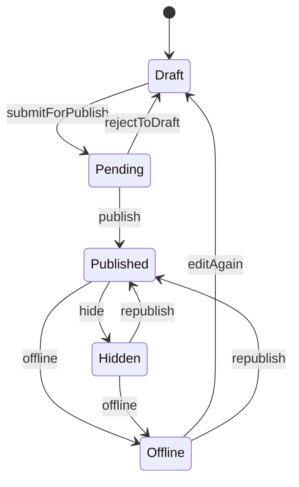

# 博客内容平台设计

这页对应“后端需支持文章状态机、时间轴、分类标签和视觉配置”的落地方案，字段设计已经与当前前端工作台保持一致，后续可以直接接入 Spring Boot + MySQL。

## 状态机流转



## 推荐表结构

### 1. `blog_article`

```sql
CREATE TABLE blog_article (
  id BIGINT PRIMARY KEY AUTO_INCREMENT,
  title VARCHAR(200) NOT NULL,
  slug VARCHAR(200) NOT NULL UNIQUE,
  summary VARCHAR(500) DEFAULT '',
  content_markdown LONGTEXT NOT NULL,
  content_html LONGTEXT DEFAULT NULL,
  status VARCHAR(32) NOT NULL,
  cover_image VARCHAR(512) DEFAULT '',
  banner_image VARCHAR(512) DEFAULT '',
  background_image VARCHAR(512) DEFAULT '',
  category_id BIGINT DEFAULT NULL,
  created_at DATETIME NOT NULL,
  updated_at DATETIME NOT NULL,
  published_at DATETIME DEFAULT NULL,
  draft_saved_at DATETIME DEFAULT NULL,
  created_by BIGINT DEFAULT NULL,
  INDEX idx_status_publish_time (status, published_at DESC),
  INDEX idx_category_id (category_id)
);
```

字段说明：

- `content_markdown` 保存编辑源文。
- `content_html` 可做渲染结果缓存，提升详情页性能。
- `cover_image`、`banner_image`、`background_image` 分别对应文章封面、头图和页面背景图。
- `status` 建议使用枚举值：`DRAFT`、`PENDING`、`PUBLISHED`、`HIDDEN`、`OFFLINE`。

### 2. `blog_category`

```sql
CREATE TABLE blog_category (
  id BIGINT PRIMARY KEY AUTO_INCREMENT,
  name VARCHAR(100) NOT NULL,
  slug VARCHAR(120) NOT NULL UNIQUE,
  parent_id BIGINT DEFAULT NULL,
  description VARCHAR(500) DEFAULT '',
  banner_image VARCHAR(512) DEFAULT '',
  background_image VARCHAR(512) DEFAULT '',
  sort_num INT DEFAULT 0,
  created_at DATETIME NOT NULL,
  updated_at DATETIME NOT NULL,
  INDEX idx_parent_id (parent_id)
);
```

字段说明：

- `parent_id` 用于多级分类树。
- 分类级 `banner_image` / `background_image` 能作为默认视觉配置，文章未单独设置时可回退使用。

### 3. `blog_tag`

```sql
CREATE TABLE blog_tag (
  id BIGINT PRIMARY KEY AUTO_INCREMENT,
  name VARCHAR(60) NOT NULL,
  slug VARCHAR(80) NOT NULL UNIQUE,
  color VARCHAR(20) DEFAULT '#3a7cff',
  created_at DATETIME NOT NULL,
  updated_at DATETIME NOT NULL
);
```

### 4. `blog_article_tag`

```sql
CREATE TABLE blog_article_tag (
  article_id BIGINT NOT NULL,
  tag_id BIGINT NOT NULL,
  PRIMARY KEY (article_id, tag_id),
  INDEX idx_tag_id (tag_id)
);
```

这张表实现文章与标签的多对多关系。

### 5. `blog_article_timeline`

```sql
CREATE TABLE blog_article_timeline (
  id BIGINT PRIMARY KEY AUTO_INCREMENT,
  article_id BIGINT NOT NULL,
  event_type VARCHAR(32) NOT NULL,
  event_title VARCHAR(200) NOT NULL,
  event_note VARCHAR(500) DEFAULT '',
  operator_id BIGINT DEFAULT NULL,
  created_at DATETIME NOT NULL,
  INDEX idx_article_id_created_at (article_id, created_at DESC),
  INDEX idx_created_at (created_at DESC)
);
```

建议事件值包括：

- `CREATED`
- `SUBMITTED`
- `PUBLISHED`
- `HIDDEN`
- `OFFLINE`
- `RESTORED`

### 6. `blog_site_visual_config`

```sql
CREATE TABLE blog_site_visual_config (
  id BIGINT PRIMARY KEY AUTO_INCREMENT,
  config_key VARCHAR(100) NOT NULL UNIQUE,
  config_name VARCHAR(100) NOT NULL,
  image_url VARCHAR(512) DEFAULT '',
  overlay_css VARCHAR(1000) DEFAULT '',
  accent_color VARCHAR(20) DEFAULT '#3a7cff',
  motion_class VARCHAR(32) DEFAULT 'aurora',
  enabled TINYINT NOT NULL DEFAULT 0,
  created_at DATETIME NOT NULL,
  updated_at DATETIME NOT NULL
);
```

这张表用于管理全局动态背景图配置。

## 后端服务职责

### 文章发布服务

- 保存 Markdown 草稿，支持高频自动保存。
- 校验状态机是否合法流转，避免直接从草稿跳到下架等脏数据。
- 发布时写入 `published_at`，并同步插入 `blog_article_timeline`。
- 隐藏 / 下架时保留文章主体，不做物理删除。

### 分类与标签服务

- 分类接口返回树形结构，前端直接渲染多级下拉与目录。
- 标签接口返回全量列表，发布接口按 `tagIds` 做批量覆盖写入。

### 时间轴服务

- 支持按文章维度查询单篇历史。
- 支持聚合查询全站动态：文章流转记录 + 系统更新记录。
- 首页或独立时间线页面按 `created_at DESC` 聚合展示。

## 推荐 API

```text
POST   /api/admin/articles/drafts
PUT    /api/admin/articles/{id}/draft
PUT    /api/admin/articles/{id}/status
GET    /api/admin/articles
GET    /api/admin/articles/{id}
POST   /api/admin/assets/upload
GET    /api/admin/categories/tree
POST   /api/admin/categories
POST   /api/admin/tags
GET    /api/timeline
```

## 实现建议

1. 自动保存建议走“幂等更新”接口，只更新草稿相关字段，避免频繁触发完整发布校验。
2. Markdown 渲染可以在保存时异步生成 `content_html`，也可以在发布时统一刷新缓存。
3. 若后续接入对象存储，封面 / Banner / 背景图字段保留 URL 即可，不需要改表结构。
