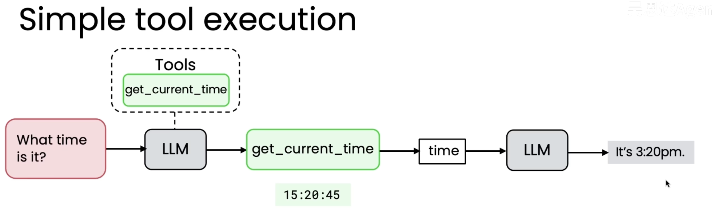
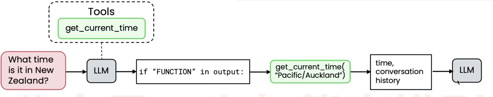
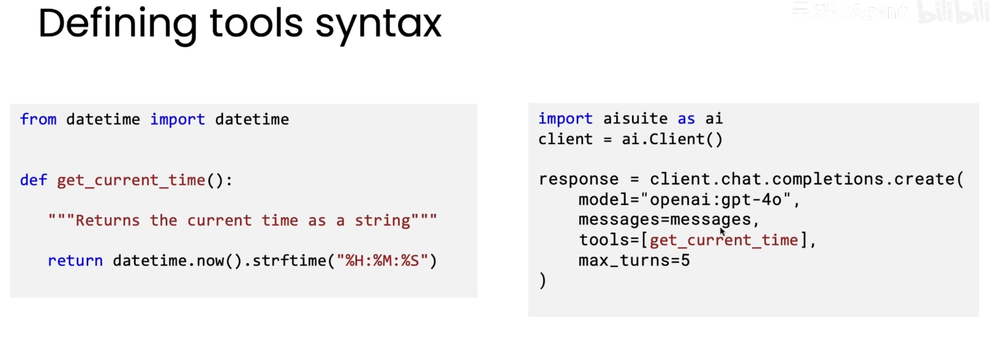
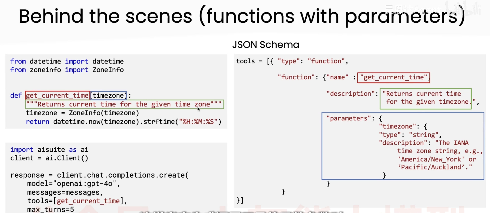

## 什么是Agent?

代理型工作流程指的是LLM应用执行多步操作来完成任务

将复杂的任务拆解成小的步骤来让Agent逐步执行来获得你想要的产出

需要学会的：
1. 学会如何将任务分解为步骤
2. 如何构建组件来高效执行每个步骤

## Agent的自主性程度

**与其争论具有什么程度的智能的智能体算的上Agent，不如承认系统可以有不同程度的智能体性**

1. 自主性较低的系统，通常所有步骤都是提前设定好的，工具使用硬编码由工程师完成，自主性主要体现在LLM生成的文本内容上
2. 半自主性的智能体，可以做部分决策，选择工具，但是工具通常是预定义好的
3. 高度自主的智能体会做出许多决策，甚至编写新函数，创建新工具并执行

## Agent的优势

1.并行处理快速完成某些操作

2.模块化可以将不同组件的优势结合起来

3.代理式流程LLM具有更高的性能表现

## Agent Egs
#### 发票识别

人工审核步骤： 1.识别需要的字段 2.记录到数据库中

Agent: PDF -> (PDF to text) -> LLM(tools:update databases) -> update database -> got it!

清晰流程的任务使用agent可以容易地完成，因为可以按步骤可靠地执行整个任务

#### 任务处理难易程度

较容易的任务是那些有明确分步流程的任务，或者企业已经有标准化流程，这些流程将更容易整理并编码到AI智能体中。

而如果任务所需的步骤事先并不明确，智能体需要边执行边规划或者解决问题，这通常更难，更不可预测，更不可靠

## 任务分解

目标：将有用的动作拆解为代理式流程的离散步骤

tips：当把任务拆解为多个步骤时，问自己一个问题，如果看步骤1，2，或3，每一步都能由LLM，段代码或者工具函数完成吗？

例子：研究型代理（AI系统针对主题X写一篇论文）

第一种方式：直接提示某个元素生成输出 -> 输出效果仅涉及表层内容，不够深入
第二种方式：拆解为代理式流程，1.关于主题X写一个大纲 2.web搜索 3.写论文 -> 输出效果内容有些割裂，文章开头和中间不太一致，结尾和前面也不太连贯
第三种方式：将第二种方式中的第三步继续拆解，把写论文细化为1.先写初稿 2.考虑哪些部分需要修改，再进行修订，然后再对论文进行批评，然后再次修改


## 智能体AI评估

高度规范的评估流程十分重要

最佳实践：
1. 先构建系统，然后检查它，找出哪些地方还令人不满意
2. 寻找评估和改进系统的方法，消除这些不满意的表现

消除不满意的表现的途径之一是添加一个评估，来追踪出错的概率

评估方法：
1. 硬编码：统计出错的概率
2. 大模型作为评审，通过prompt，让它输出分数
3. 端到端评估：衡量整个智能体的输出质量
4. 组件级评估：评估智能体流程中某一步的输出质量
5. 检查中间输出：逐步阅读每级的中间输出


## 智能体的设计模式

作用：构建模块组合成更复杂的工作流

### Reflection(反思)
让LLM检查自己的输出，或者引入一些外部的信息来源
```
	Eg：
	Me : Please write code for {task}
	LLM1 : def do_task(x):...
	Me: Prompt(Here's code intended for {task} def do_task(x):... Check the code and give constructive criticism for how to improve it.) -> LLM2(生成结果给LLM1) -> LLM1
	LLM1: def do_task(x)v2:...
	Me:实际运行后发现bug，将错误信息反馈给LLM1
	LLM1:def do_task(x)v3:...
```
外部信息能极大地提升大模型生成信息的质量，将代码输出和错误日志反馈给LLM，让它根据反馈反射并写新代码。

1. 零样本提示
2. 单/少/多样本提示：在提示中加入一个或多个你期望的输出的示例

**Tips**:提升写提示词的一个方法就是多阅读他人的提示词

#### 提示词示例

**Code generation：**
```
Write pyhton code to generate a visualization that answers the user's question
写一段pyhton代码生成一个可视化图表来回答用户的问题
{user prompt}
```
**Reflection:**
```
你是一个数据分析专家角色，对可视化图表提供建设性反馈
{v1 code} {plot.png} {conversation history}
Step1：从可读性、清晰度、完整性方面批评这个图表
Step2：编写新代码，实现你的改进建议
```

**思考**：为什么要将历史对话{conversation history}也传给Reflection模型？
	- 核对是否答非所问，如果仅有代码和图片仅能判断是否美观
	- 继承并遵循约束
	- 避免陷入死循环或之前的坑
	- 保持业务连贯性

**Tips**：用推理型模型进行Reflection效果有时要比非推理型模型的效果更好

#### 评估反射的影响

###### 为什么要评估？
	反射会让系统变慢，所以需要再次确认它实际提升了多少性能


### Tool use（工具使用）
	大模型可以被赋予工具，意思是它们可以调用函数来完成任务，LLM可以自主决定是否使用这些工具的任何一个
	工具就是我们提供给大模型的函数，大模型选择要调用哪个函数，然后程序执行这个函数获得结果，再将这个结果返回给大模型。
	并不是大模型直接调用了函数，而是大模型请求你去调用某个函数

#### Egs：


#### 创建工具：

工具就是LLM可以请求执行的代码或函数

##### Old Fashion：

System prompt:
```
你有权限调用get_currnt_time这个工具，为了去使用它，严格返回以下格式的内容
FUNCTION:
get_current_time()
```

Function:
```
from datetime import datetime
def get_current_time():
	"""Returns the current time as a string"""
	return datetime.now().strftime("%H:%M:%S")
```


##### Model Fashion：



### Planning（规划）
	在规划中，LLM会决定需要采用哪些行动顺序；具备规划能力的智能体更难控制，但有时能带来十分惊喜的结果

### Multi-agent collaboration（多智能体协作） 
	多智能体配合工作，每个智能体可能专注于不同的角色


