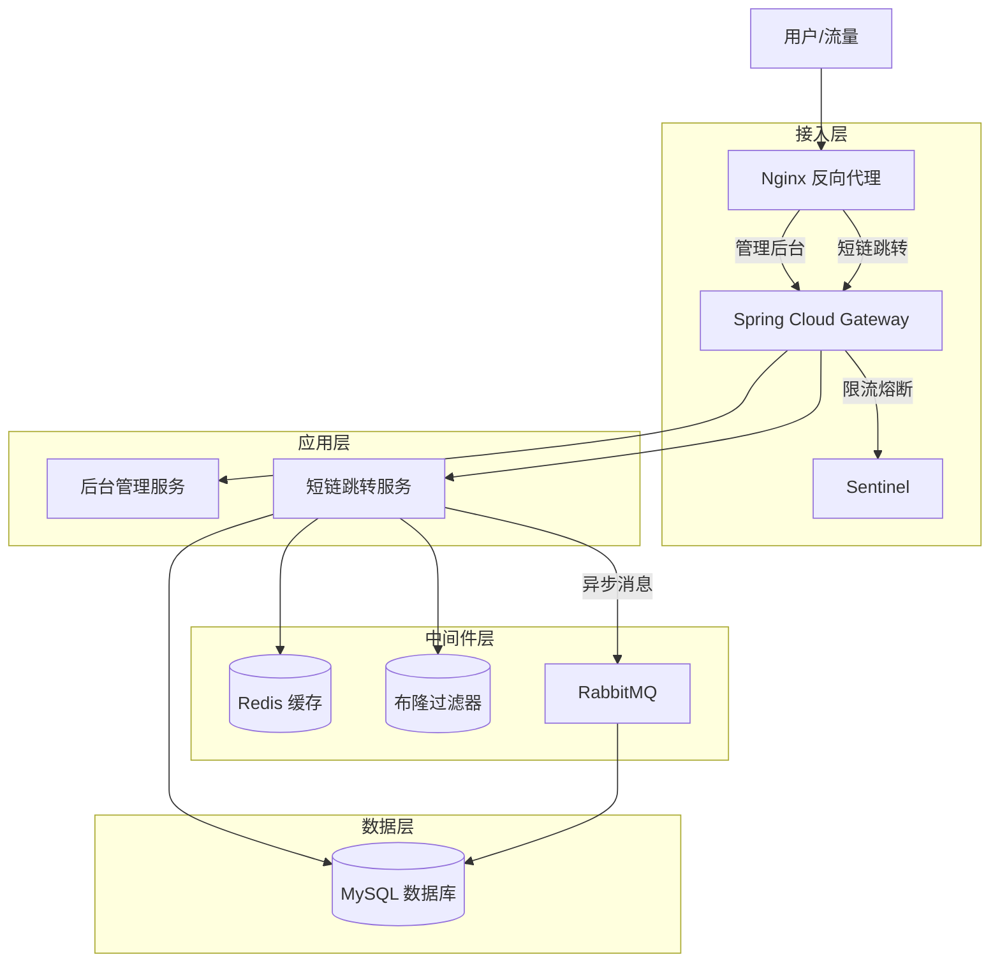

# 短链接 SaaS 系统 

## 在线体验地址

- [项目地址](http://49.235.145.211/)

## 1. 总体架构

本项目是一个高性能、高并发的短链接 SaaS 平台，采用前后端分离架构。系统核心目标是提供快速的短链生成与极速的跳转服务，同时具备完善的用户管理、分组管理及数据统计功能。


### 1.1 技术栈

* **前端**: Vue 3 + Vite + Element Plus + Pinia + Axios
* **后端**: Java Spring Boot + MyBatis Plus
* **网关**: Spring Cloud Gateway + Alibaba Sentinel (限流)
* **中间件**:
    * **MySQL**: 持久化存储用户、分组及短链映射数据。
    * **Redis**: 缓存短链跳转映射，提供毫秒级读取性能。
    * **Redisson**: 提供布隆过滤器 (Bloom Filter) 及分布式锁。
    * **RabbitMQ**: 消息队列，用于异步解耦、削峰填谷及数据最终一致性保障。
* **基础设施**: Nginx (反向代理与域名分流)。

### 1.2 架构分层图解



---

## 2. 各个模块介绍

### 2.1 用户模块 (User Service)
负责用户的认证与授权，支持多渠道登录体系。
* **核心功能**:
    * **多方式登录**: 账号密码
    * **状态管理**: 前端使用 Pinia 持久化 Token 和 UserInfo，分离 API 与 Store 逻辑，解决引用耦合问题。

### 2.2 分组管理模块 (Group Service)
采用“先分组，后短链”的逻辑，帮助用户隔离不同业务场景的短链。
* **交互优化**: 前端集成 `vuedraggable` 实现分组拖拽排序，侧边栏采用扁平化导航设计，提升用户体验。

### 2.3 短链核心模块 (ShortLink Core)
系统的核心业务，重点是解决高并发下的**数据一致性**问题以及短链接快速跳转。

#### 2.3.1 创建短链 (Create)
* **短链生成**: 原始短链接拼接上随机生成的字符串作为后缀，通过MurmurHash算法转换为32位的整数，之后由Base62转换为5-6位的字符串作为短链，再拼接域名前缀得到完整短链接。
* **防冲突设计**: 使用布隆过滤器预先检查生成的短链后缀 (Suffix) 是否存在，如果存在则在原始链接的基础上拼接UUIDRandom().toString()重试，极大程度上减少哈希冲突。
* **双写策略**: 短链生成后，同时写入 MySQL 和 Redis，确保创建即刻可用。

#### 2.3.2 短链跳转 (Read)
* **缓存架构**: 由于Spring Cloud Gateway 基于 Netty（非阻塞 I/O），适合处理高并发连接，所以在网关层加入Redis缓存。
* **跳转流程**: 当用户访问短链时，网关过滤器（Filter）会拦截请求，直接通过 Lua 脚本查询 Redis。这个Lua 脚本做两件事：一是查询短链对应的原始 URL，二是原子性地对访问量（PV）进行自增。如果 Redis 命中，网关直接返回 HTTP 302 状态码和 Location 头，完成跳转。这样做的好处是请求完全不需要经过后端的业务服务模块，也不需要查数据库，极大地降低了响应延迟。如果 Redis 查不到（返回 nil），网关会将请求放行（Chain.filter），让它继续走到后端的 Link-Service。后端服务查数据库拿到结果后,会先返回给用户，同时通过直接回写 Redis，如果是热点数据，会加上分布式锁来防止大量请求瞬间击穿数据库。
```lua
-- KEYS[1]: PV key
-- KEYS[2]: UV key (基于 Cookie)
-- KEYS[3]: UIP key (基于 IP) -> 新增这个
-- ARGV[1]: User Cookie
-- ARGV[2]: Client IP -> 新增这个

-- 1. PV 自增
redis.call('incr', KEYS[1])

-- 2. UV 去重统计 (HyperLogLog)
redis.call('pfadd', KEYS[2], ARGV[1])

-- 3. UIP 去重统计 (HyperLogLog) 
redis.call('pfadd', KEYS[3], ARGV[2])

return 1
```
UV 和 UIP 统计使用了 Redis 的 HyperLogLog。相比于 Set 集合，HyperLogLog 在牺牲极小精度（约 0.81% 误差）的情况下，将内存占用降低到了固定的 12KB，减少了内存消耗问题。
* **数据处理**: 
```java
@Component
@Slf4j
public class StatsConsumer {
    @Autowired
    private ShortLinkAccessLogsMapper accessLogsMapper;
    // 1. 内存缓冲池：用来暂存 MQ 发来的消息
    private final List<ShortLinkStatsRecordDTO> bufferList = Collections.synchronizedList(new ArrayList<>());
    // 2. 监听 MQ 队列
    @RabbitListener(queues = "short_link_stats_queue")
    public void onMessage(ShortLinkStatsRecordDTO message) {
        // 收到消息，先存入内存 list 里
        bufferList.add(message);
        // 积攒50条消息后处理
        if (bufferList.size() >= 50) {
            flushBufferToDb();
        }
    }
    // 3. 定时任务
    // 每隔 5 秒执行一次（防止流量低时，数据一直卡在内存里不入库）
    @Scheduled(fixedRate = 5000)
    public void timeTrigger() {
        if (!bufferList.isEmpty()) {
            flushBufferToDb();
        }
    }
    // 4. 批量入库
    public synchronized void flushBufferToDb() {
        if (bufferList.isEmpty()) {
            return;
        }
        // 拷贝一份数据出来处理，清空原 buffer，防止并发问题
        List<ShortLinkStatsRecordDTO> tempBuffer = new ArrayList<>(bufferList);
        bufferList.clear();
        try {
            log.info("开始批量入库，本次条数：{}", tempBuffer.size());
            // 这一步调用 MyBatis 的批量插入
            accessLogsMapper.batchInsert(tempBuffer);
        } catch (Exception e) {
            log.error("批量入库失败", e);
            // 把 tempBuffer 里的数据重新塞回 MQ 
        }
    }
}
```
* **缓存击穿防护**: 针对热点 Key 设置逻辑过期或使用互斥锁（Mutex Key），防止高并发下缓存失效打崩数据库。

#### 2.3.3 修改/删除短链与数据一致性
在修改短链（如修改原始链接、有效期）或删除短链时，面临 Database 和 Cache 数据不一致的挑战。本项目采用 **“延时双删” + “MQ 补偿”** 策略：

* **逻辑流程**: 1.第一次删除：先删除 Redis 缓存。2.更新数据库：执行 MySQL UPDATE 操作。3.发送消息到 MQ：将“删除缓存”的任务投递到 RabbitMQ，并设置 延迟时间（比如 500ms）。4.第二次删除（MQ 消费）：消费者收到消息后，再次删除 Redis 缓存。

伪代码：
```java
// 1. 先删缓存
stringRedisTemplate.delete("link_detail_" + fullShortUrl);
// 2. 更新数据库(或者删除)
baseMapper.updateById(linkDO);
// 3. 发送延时消息到 RabbitMQ (实现异步解耦)
rabbitTemplate.convertAndSend(
    "delay_exchange", 
    "delay_routing_key", 
    msgDTO, 
    message -> {
        message.getMessageProperties().setDelay(500); // 插件实现的延迟消息
        return message;
    }
);
```
消息队列：
```java
@RabbitListener(queues = "cache_delete_queue")
public void deleteCacheConsumer(ShortLinkMsgDTO msg, Channel channel, Message message) {
    try {
        // 1. 执行第二次删除
        String redisKey = msg.getKey();
        stringRedisTemplate.delete(redisKey);
        // 2. 手动 ACK，确认任务完成
        channel.basicAck(message.getMessageProperties().getDeliveryTag(), false);
    } catch (Exception e) {
        // 3. 如果删除失败重新发回队列；超过次数记录数据库人工处理
        log.error("缓存删除失败，准备重试", e);
        retryService.retry(msg); 
    }
}
```
* **技术选型**: 使用Canal 监听 Binlog 也可以来做同步，但是对于短链系统来说，修改操作并不频繁（读多写少），使用 延时双删 + MQ 是性价比较高。而且 MQ 本身就是系统已有的组件，复用性好。”
---

## 3. 其他项目亮点

### 3.1 ShardingSphere分库分表

#### 3.1.1 垂直分库
把原本放在一个 shortlink 库里的所有表，按照业务模块拆分到不同的数据库实例中。可以隔离风险 + 突破单机连接数瓶颈。如果后台管理员导报表把库 A 的 CPU 跑满了，不会影响库 B 里的短链跳转业务。
库 A (shortlink_admin)：放 t_user, t_group（管理后台用，读写低频）。
库 B (shortlink_project)：放 t_link, t_link_access_logs（核心业务用，读写高频）。

#### 3.1.2 水平分库
针对数据量增长最快的 访问日志表 (t_link_access_logs)，按时间分片把它拆成 N 张小表。因为日志数据的查询具有很强的时间热度特性。商家和运营主要关注最近一周或一个月的数据（热数据），按时间分片，查询可以直接路由到当月或上月的表，效率最高。

### 3.2 全局异常处理器 (Global Exception Handler)
构建了标准化的异常处理机制，提升系统的健壮性和前端交互体验。
* **统一封装**: 定义 `GlobalExceptionHandler` 类，捕获 `RuntimeException`、`MethodArgumentNotValidException` 等。
* **标准化输出**: 所有异常均转换为统一的 `Result<T>` 结构 (`code`, `message`, `data`) 返回给前端。
* **限流异常适配**: 针对 Sentinel 抛出的 `BlockException` 进行特殊处理，返回 HTTP 429 状态码及友好的 "访问过于频繁" 提示，避免直接暴露系统底层错误。

---

## 4. 压测数据报告

本次压测针对系统的核心接口 **短链跳转 (Read Operation)** 进行了本地环境的高并发测试。

### 4.1 测试环境
* **工具**: Apache JMeter 5.x
* **配置**: 200 并发线程，持续 60 秒。
* **策略**: 关闭 `Follow Redirects`（模拟网关响应能力）；Sentinel 阈值调至 10000（模拟高并发场景）。

### 4.2 核心指标结果

| 指标 (Metric) | 结果 (Value) | 说明 |
| :--- | :--- | :--- |
| **样本数 (# Samples)** | 200,000 | 总共完成 20 万次跳转请求 |
| **平均响应时间 (Average)** | **59 ms** | 高并发负载下的平均耗时，用户无感知 |
| **吞吐量 (Throughput)** | **3057.4 /sec** | 单机 QPS 突破 3000，具备亿级流量支撑能力 |
| **错误率 (Error %)** | **0.01%** | 仅偶发端口耗尽错误，业务逻辑零失败 |
| **最大响应 (Max)** | 504 ms | 无长尾卡顿，系统未发生熔断 |
| **响应状态码** | 302 Found | 成功命中缓存并返回重定向地址 |

### 4.3 结论
系统在引入 Redis 缓存与 RabbitMQ 异步削峰后，单机具备 **3000+ QPS** 的处理能力。数据一致性方案有效闭环，未出现缓存脏读现象。

---

## 5. 总结

本项目构建了一个具备**高可用、高并发、高一致性**特性的短链接 SaaS 系统。

* **架构层面**: 通过微服务网关、Sentinel 限流保护系统稳定性；利用 RabbitMQ 实现核心业务解耦与流量削峰。
* **代码层面**: 实现了全局异常统一处理、优雅的前端状态管理和标准化的代码规范。
* **数据层面**: 通过 Redis + MySQL + RabbitMQ 的组合拳，完美解决了短链系统中最棘手的**缓存穿透**和**数据一致性**问题。
