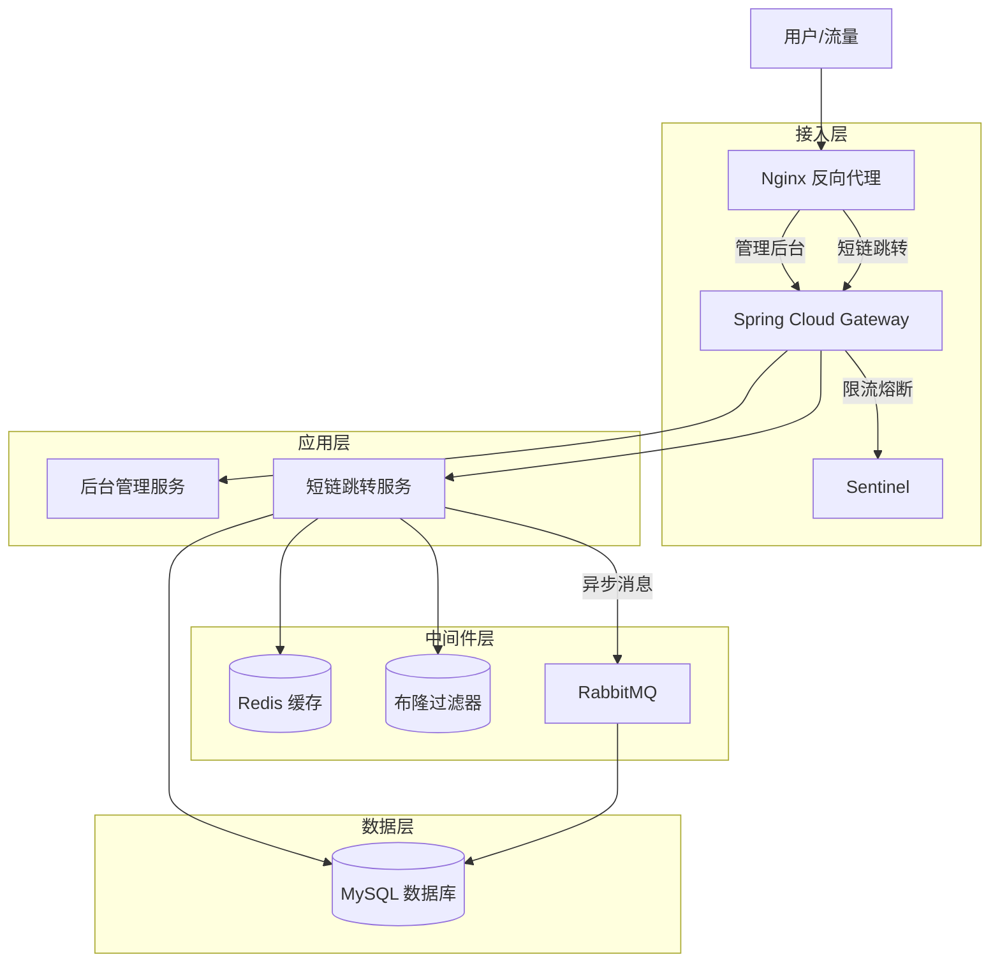

# 短链接 SaaS 系统 (ShortLink Cloud) - 项目知识文档

## 1. 总体架构

本项目是一个高性能、高并发的企业级短链接 SaaS 平台，采用前后端分离架构。系统核心目标是提供快速的短链生成与极速的跳转服务，同时具备完善的用户管理、分组管理及数据统计功能。

### 1.1 技术栈

* **前端**: Vue 3 + Vite + Element Plus + Pinia + Axios
* **后端**: Java Spring Boot + MyBatis Plus
* **网关**: Spring Cloud Gateway + Alibaba Sentinel (限流)
* **中间件**:
    * **MySQL**: 持久化存储用户、分组及短链映射数据。
    * **Redis**: 缓存短链跳转映射，提供毫秒级读取性能。
    * **Redisson**: 提供布隆过滤器 (Bloom Filter) 及分布式锁。
    * **RabbitMQ**: 消息队列，用于异步解耦、削峰填谷及数据最终一致性保障。
* **基础设施**: Nginx (反向代理与域名分流)。

### 1.2 架构分层图解

---

## 2. 各个模块介绍

### 2.1 用户模块 (User Service)
负责用户的认证与授权，支持多渠道登录体系。
* **核心功能**:
    * **多方式登录**: 账号密码、手机验证码、GitHub 社交登录（OAuth2 闭环，自动注册/绑定）。
    * **状态管理**: 前端使用 Pinia 持久化 Token 和 UserInfo，分离 API 与 Store 逻辑，解决引用耦合问题。

### 2.2 分组管理模块 (Group Service)
采用“先分组，后短链”的逻辑，帮助用户隔离不同业务场景的短链。
* **交互优化**: 前端集成 `vuedraggable` 实现分组拖拽排序，侧边栏采用扁平化导航设计，提升用户体验。

### 2.3 短链核心模块 (ShortLink Core)
系统的核心业务，涵盖增删改查全生命周期管理，重点解决高并发下的**数据一致性**问题。

#### 2.3.1 创建短链 (Create)
* **防冲突设计**: 使用 Redisson 布隆过滤器预先检查生成的短链后缀 (Suffix) 是否存在，极大降低对数据库唯一索引的依赖，提升写入性能。
* **双写策略**: 短链生成后，同时写入 MySQL 和 Redis，确保创建即刻可用。

#### 2.3.2 短链跳转 (Read)
* **极速响应**: 网关拦截请求 -> 查询 Redis 缓存 -> 返回 HTTP 302 重定向。
* **缓存击穿防护**: 针对热点 Key 设置逻辑过期或使用互斥锁（Mutex Key），防止高并发下缓存失效打崩数据库。

#### 2.3.3 修改/删除短链与数据一致性 (Update/Delete)
在修改短链（如修改原始链接、有效期）或删除短链时，面临 Database 和 Cache 数据不一致的挑战。本项目采用 **“延时双删” + “MQ 补偿”** 策略：

1.  **先更新数据库**: 保证持久化数据正确。
2.  **删除缓存**: 删除 Redis 中的旧数据。
3.  **异步保障**: 
    * 将操作消息发送至 RabbitMQ。
    * 消费者在短暂延迟后（如 1秒），**再次尝试删除缓存**。
    * **目的**: 防止在“数据库更新未完成”与“缓存已删除”的间隙中，有并发读请求将旧数据脏读回缓存。

---

## 3. 项目亮点

### 3.1 异步处理与解耦 (RabbitMQ)
引入 RabbitMQ 解决高并发写操作的性能瓶颈：
* **访问统计 (PV/UV)**: 短链跳转时，不直接操作数据库记录日志，而是发送消息到 MQ。消费者异步批量入库，极大地降低了跳转接口的响应时间（TP99 优化）。
* **最终一致性**: 利用 MQ 的重试机制（Dead Letter Queue），确保在缓存删除失败时进行补偿重试。

### 3.2 全局异常处理器 (Global Exception Handler)
构建了标准化的异常处理机制，提升系统的健壮性和前端交互体验。
* **统一封装**: 定义 `GlobalExceptionHandler` 类，捕获 `RuntimeException`、`MethodArgumentNotValidException` 等。
* **标准化输出**: 所有异常均转换为统一的 `Result<T>` 结构 (`code`, `message`, `data`) 返回给前端。
* **限流异常适配**: 针对 Sentinel 抛出的 `BlockException` 进行特殊处理，返回 HTTP 429 状态码及友好的 "访问过于频繁" 提示，避免直接暴露系统底层错误。

### 3.3 高性能架构设计
* **布隆过滤器**: 解决海量短链生成时的数据库查重性能问题。
* **读写分离设计**: 跳转接口（Read）走缓存，管理接口（Write）走数据库+MQ，互不干扰。

### 3.4 社交登录深度集成
* 重构 User 模块，实现了完整的 GitHub OAuth2 流程，包括前端跳转、后端回调处理、自动注册用户与账号绑定逻辑。

---

## 4. 压测数据报告

本次压测针对系统的核心接口 **短链跳转 (Read Operation)** 进行了本地环境的高并发测试。

### 4.1 测试环境
* **工具**: Apache JMeter 5.x
* **配置**: 200 并发线程，持续 60 秒。
* **策略**: 关闭 `Follow Redirects`（模拟网关响应能力）；Sentinel 阈值调至 10000（模拟高并发场景）。

### 4.2 核心指标结果

| 指标 (Metric) | 结果 (Value) | 说明 |
| :--- | :--- | :--- |
| **样本数 (# Samples)** | 200,000 | 总共完成 20 万次跳转请求 |
| **平均响应时间 (Average)** | **59 ms** | 高并发负载下的平均耗时，用户无感知 |
| **吞吐量 (Throughput)** | **3057.4 /sec** | 单机 QPS 突破 3000，具备亿级流量支撑能力 |
| **错误率 (Error %)** | **0.01%** | 仅偶发端口耗尽错误，业务逻辑零失败 |
| **最大响应 (Max)** | 504 ms | 无长尾卡顿，系统未发生熔断 |
| **响应状态码** | 302 Found | 成功命中缓存并返回重定向地址 |

### 4.3 结论
系统在引入 Redis 缓存与 RabbitMQ 异步削峰后，单机具备 **3000+ QPS** 的处理能力。数据一致性方案有效闭环，未出现缓存脏读现象。

---

## 5. 总结

本项目构建了一个具备**高可用、高并发、高一致性**特性的短链接 SaaS 系统。

* **架构层面**: 通过微服务网关、Sentinel 限流保护系统稳定性；利用 RabbitMQ 实现核心业务解耦与流量削峰。
* **代码层面**: 实现了全局异常统一处理、优雅的前端状态管理和标准化的代码规范。
* **数据层面**: 通过 Redis + MySQL + RabbitMQ 的组合拳，完美解决了短链系统中最棘手的**缓存穿透**和**数据一致性**问题。

这不仅是一个功能完备的业务系统，更是一个经过压测验证的高性能解决方案。